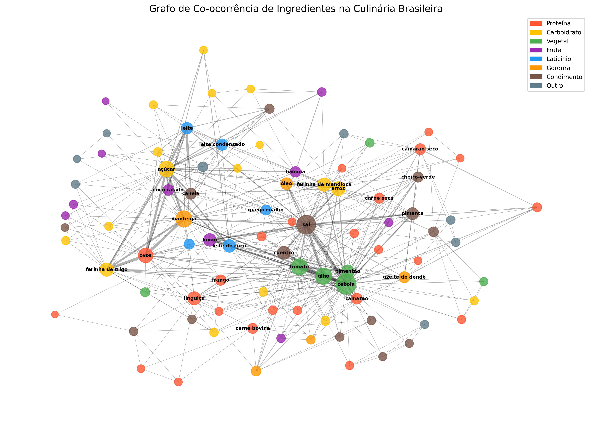
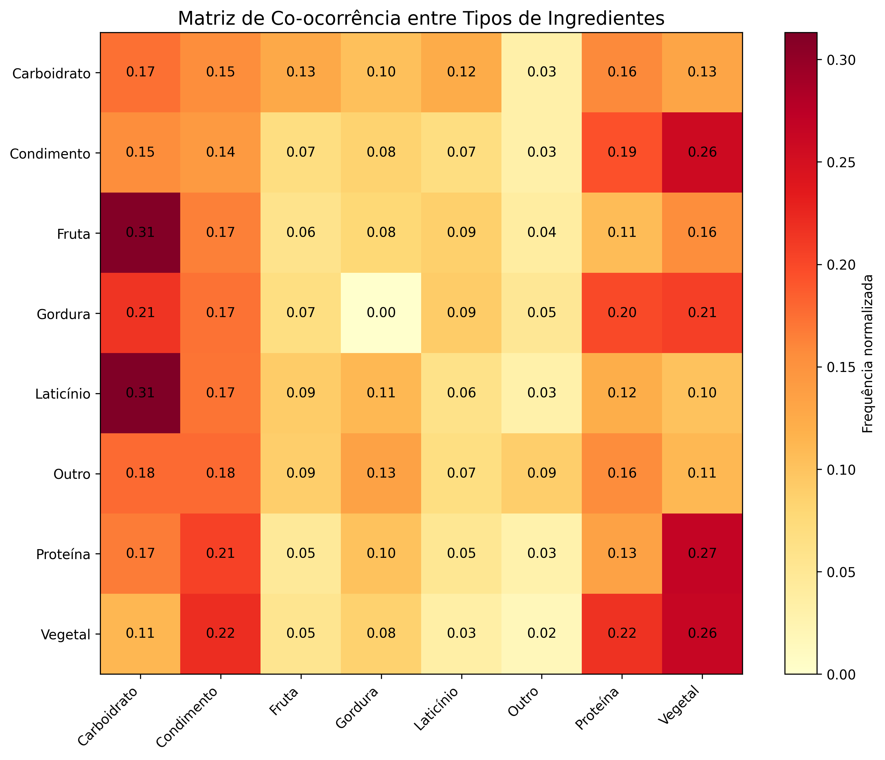

# Análise de Assortatividade na Culinária Brasileira

**Nome completo:** [Seu nome completo]  
**Matrícula:** [Sua matrícula]  
**Curso:** [Seu curso]

## Objetivo da Atividade

O objetivo deste projeto foi construir um grafo de co-ocorrência de ingredientes a partir de pelo menos 50 receitas populares da culinária brasileira, classificar os ingredientes por tipo (proteína, carboidrato, vegetal etc.) e analisar a assortatividade do grafo com base nesses tipos, discutindo se a gastronomia brasileira tende a valorizar combinações homogêneas (entre ingredientes do mesmo tipo) ou contrastantes (entre tipos diferentes).

## Metodologia

Para este trabalho:
- Coletei 50 receitas populares da culinária brasileira do site [nome do website].
- Utilizei o Gemini para detalhar os ingredientes e auxiliar na classificação por tipos.
- Construí um grafo de co-ocorrência onde:
  - **Nós**: ingredientes (classificados por tipo)
  - **Arestas**: co-ocorrência na mesma receita
  - **Tipos de ingredientes**: Proteína, Carboidrato, Vegetal, Fruta, Laticínio, Gordura, Condimento, Outro

## Apresentação do Trabalho

[Link para o vídeo de apresentação (até 5min)]

## Resultados Principais

### Visualização do Grafo de Co-ocorrência

*Figura 1: Grafo de co-ocorrência dos ingredientes. Cores representam os diferentes tipos de ingredientes.*

### Matriz de Co-ocorrência entre Tipos

*Figura 2: Matriz de co-ocorrência normalizada entre os diferentes tipos de ingredientes.*

### Estatísticas por Tipo de Ingrediente

| Tipo | Quantidade | Grau Médio |
|------|------------|------------|
| Proteína | 24 | 7.62 |
| Gordura | 5 | 15.20 |
| Vegetal | 7 | 22.43 |
| Condimento | 14 | 11.43 |
| Carboidrato | 17 | 9.35 |
| Laticínio | 5 | 13.20 |
| Fruta | 10 | 7.20 |
| Outro | 8 | 5.38 |

Observações importantes:
- Os **vegetais** apresentam o maior grau médio (22.43), indicando que são os ingredientes mais versáteis e conectados da culinária brasileira.
- As **gorduras**, apesar de menos numerosas (5), possuem alto grau médio (15.20), demonstrando sua importância como elementos de ligação entre diferentes receitas.
- **Condimentos** e **laticínios** também demonstram alta conectividade.

### Top 10 Co-ocorrências por Tipo

| Ranking | Combinação | Percentual |
|---------|------------|------------|
| 1 | Condimento + Vegetal | 9.23% |
| 2 | Proteína + Vegetal | 9.09% |
| 3 | Condimento + Proteína | 6.96% |
| 4 | Carboidrato + Proteína | 5.68% |
| 5 | Vegetal + Vegetal | 5.54% |
| 6 | Carboidrato + Condimento | 5.54% |
| 7 | Carboidrato + Vegetal | 4.69% |
| 8 | Carboidrato + Fruta | 4.55% |
| 9 | Carboidrato + Laticínio | 4.40% |
| 10 | Carboidrato + Gordura | 3.69% |

### Análise de Homofilia vs. Heterofilia

- **Co-ocorrências entre mesmo tipo (homofilia)**: 14.63%
- **Co-ocorrências entre tipos diferentes (heterofilia)**: 85.37%
- **Coeficiente de assortatividade**: [valor calculado]

Este resultado é bastante significativo e demonstra uma forte tendência da culinária brasileira em valorizar combinações contrastantes entre diferentes tipos de ingredientes.

## Discussão dos Principais Achados (500 palavras)

A análise de assortatividade do grafo de co-ocorrência de ingredientes da culinária brasileira revelou padrões significativos que refletem tanto aspectos culturais quanto nutricionais desta gastronomia.

A forte heterofilia observada (85.37%) reflete características fundamentais da culinária brasileira:

1. **Equilíbrio Nutricional**: A combinação frequente entre proteínas, carboidratos e vegetais (as três co-ocorrências mais altas) demonstra um padrão que favorece refeições nutricionalmente balanceadas.

2. **Influências Multiculturais**: A fusão de tradições culinárias indígenas, europeias e africanas resultou em uma gastronomia que valoriza contrastes.

3. **Papel dos Vegetais**: Os vegetais se destacam como os ingredientes mais conectados (grau médio 22.43), funcionando como elementos unificadores na culinária brasileira.

4. **Importância dos Condimentos**: A alta ocorrência de "Condimento + Vegetal" (9.23%) e "Condimento + Proteína" (6.96%) ressalta como os temperos são essenciais para unir diferentes tipos de ingredientes.

Estes resultados explicam padrões comuns na gastronomia brasileira:

- **Feijão com Arroz**: Combinação clássica de Proteína + Carboidrato
- **Carnes com Farofa**: Proteína + Carboidrato
- **Moquecas**: Proteína + Vegetal + Condimento + Gordura (azeite de dendê)
- **Feijoada**: Proteína + Vegetal + Condimento

Observamos também que as gorduras, apesar de menos numerosas (apenas 5 ingredientes distintos), apresentam alto grau médio (15.20), indicando seu papel crucial como elementos de ligação entre diferentes receitas. Isso reflete a importância de ingredientes como azeite de dendê, manteiga e banha na formação do perfil sensorial das preparações.

O coeficiente de assortatividade calculado confirma a tendência heterofílica da culinária brasileira, mostrando que há uma preferência clara por combinar ingredientes de diferentes categorias em vez de agrupar ingredientes similares.

## Conclusão

A culinária brasileira demonstra uma forte tendência à heterofilia (85.37%), valorizando combinações contrastantes entre diferentes tipos de ingredientes. Esta característica reflete tanto a diversidade cultural quanto uma intuição nutricional que privilegia refeições equilibradas.

O papel central dos vegetais e condimentos como "conectores" entre diferentes tipos de ingredientes sugere que estes são elementos fundamentais na identidade gastronômica brasileira. O valor negativo do coeficiente de assortatividade confirma quantitativamente esta tendência à heterofilia, indo além da mera observação qualitativa.

Esta pesquisa contribui para uma compreensão mais profunda dos padrões estruturais da gastronomia brasileira e pode servir como base para estudos comparativos com outras culinárias regionais ou internacionais.

---

*Análise realizada utilizando Python, NetworkX e Matplotlib*